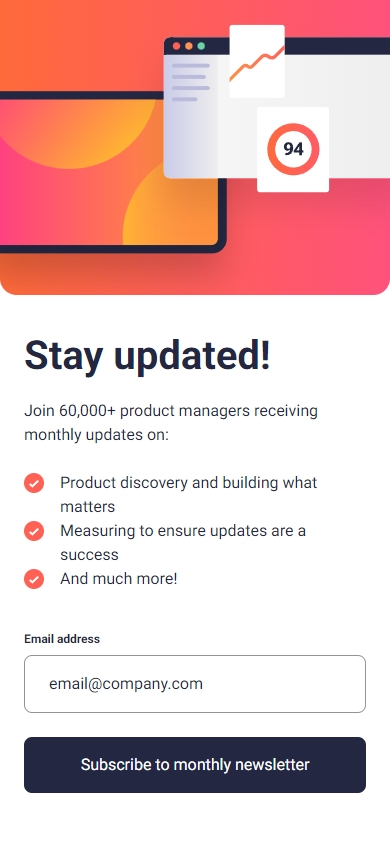
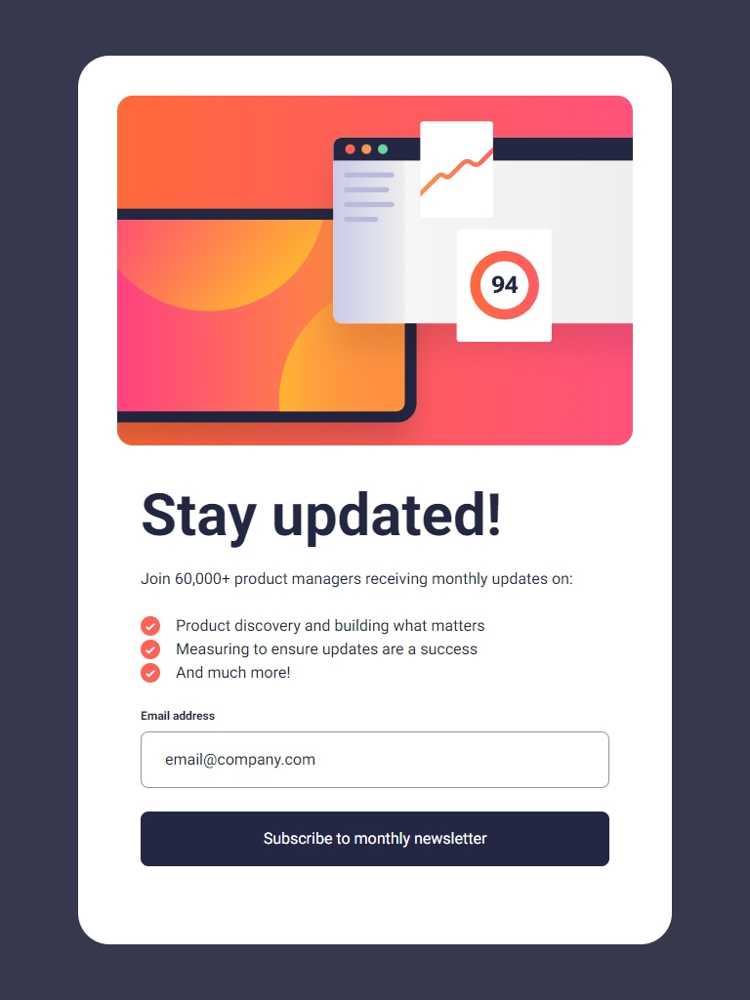
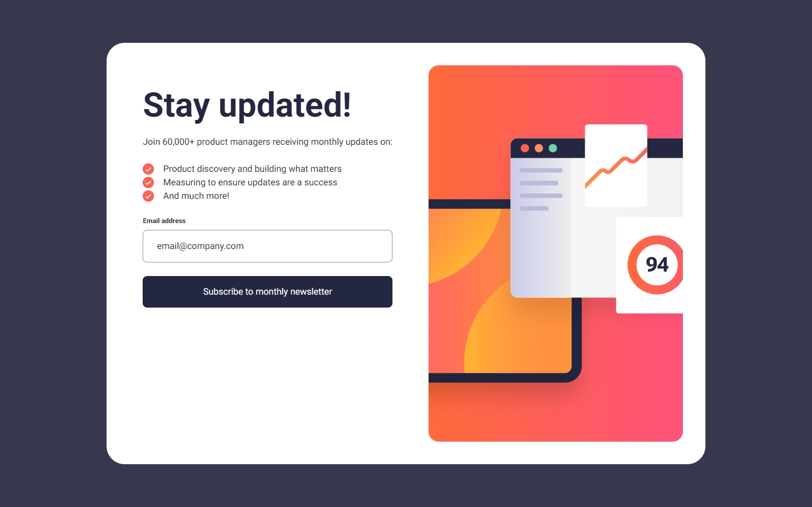

# Newsletter Sign Up

A responsive newsletter sign up page built with **React**, **Vite**, and **Tailwind CSS**.  
This project is a solution to the [Frontend Mentor Newsletter Sign Up Challenge](https://www.frontendmentor.io/challenges/newsletter-signup-form-with-success-message-3FC1AZbNrv).

## LIVE SITE:

[](https://aflamiano-career.github.io/newsletter-sign-up/)

---

## Table of contents

- [Overview](#overview)
  - [The Feature](#the-feature)
  - [Screenshots](#screenshots)
- [My process](#my-process)
  - [Built with](#built-with)
- [Acknowledgements](#acknowledgements)

---

## Overview

### The Feature

Users should be able to:

- Add their email and submit the form
- See a success message with their email after successfully submitting the form
- See form validation messages if:

  - The field is left empty
  - The email address is not formatted correctly

- View the optimal layout for the interface depending on their device's screen size
- See hover and focus states for all interactive elements on the page

### Screenshots (Click to view larger)

  

---

## Built with

- Semantic HTML5 markup
- CSS custom properties
- Flexbox
- Mobile-first workflow
- [React](https://reactjs.org/) - Component-based JS library.
- [React Hook Form](https://react-hook-form.com/) - React form validation library
- [Tailwind CSS](https://tailwindcss.com/) - Utility-first CSS framework.
- [Vite](https://vitejs.dev/) - Fast and lean development build tool.
- JavaScript (ES6): Modern JavaScript features and best practices.

#### Sample code

```jsx
<form onSubmit={handleSubmit(onSubmit)} noValidate>
  <div className="flex flex-col">
    <div className="flex justify-between font-bold text-xs mb-2">
      <label htmlFor="email">Email address</label>
      {errors.email && <p className="text-red">{errors.email.message}</p>}
    </div>
    <input
      className={`px-6 py-4 rounded-lg border-[1px] mb-6  ${
        errors.email
          ? "border-red bg-red-100 focus:bg-red-100 focus-visible:bg-red-100 focus-visible:outline-red"
          : "border-grey"
      }`}
      type="email"
      id="email"
      placeholder="email@company.com"
      {...register("email", {
        required: "The field is empty",
        pattern: {
          value: /\S+@\S+\.\S+/,
          message: "Valid email required",
        },
      })}
    />
    <Button>Subscribe to monthly newsletter</Button>
  </div>
</form>
```

---

## Acknowledgements

- [Frontend Mentor](https://www.frontendmentor.io/) for the challenge and design inspiration.

---
